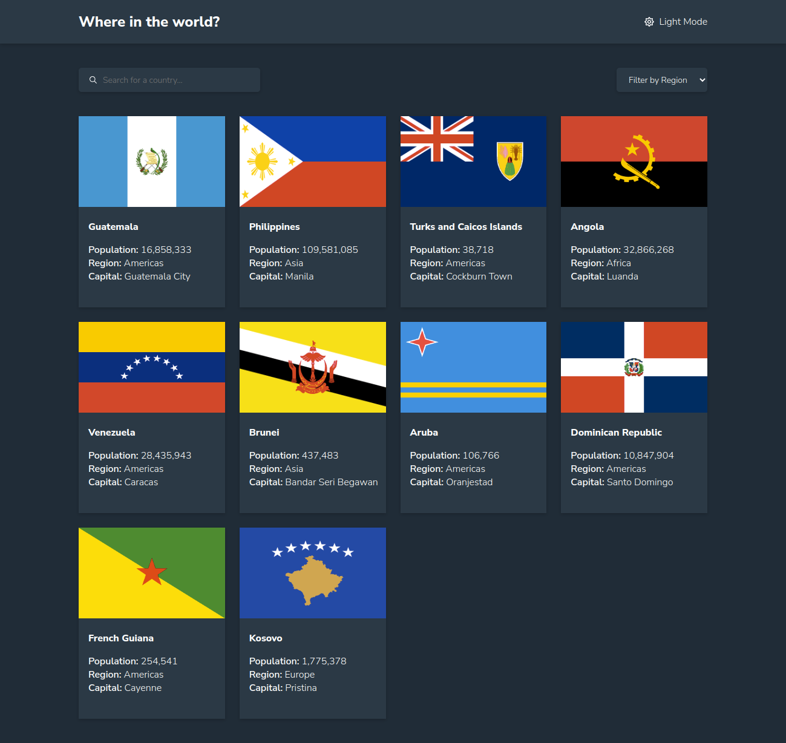
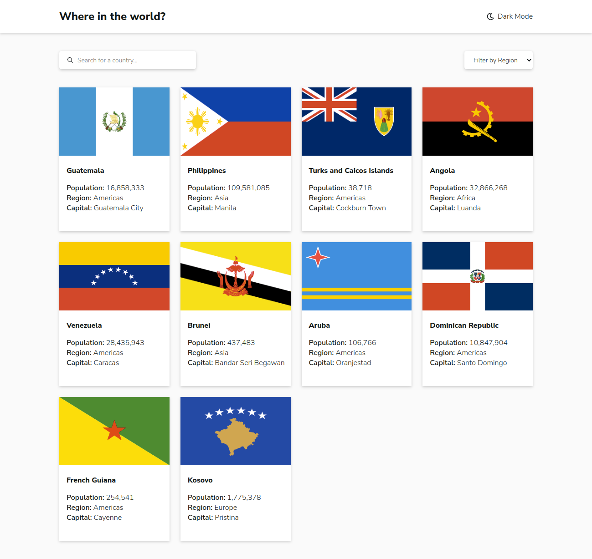
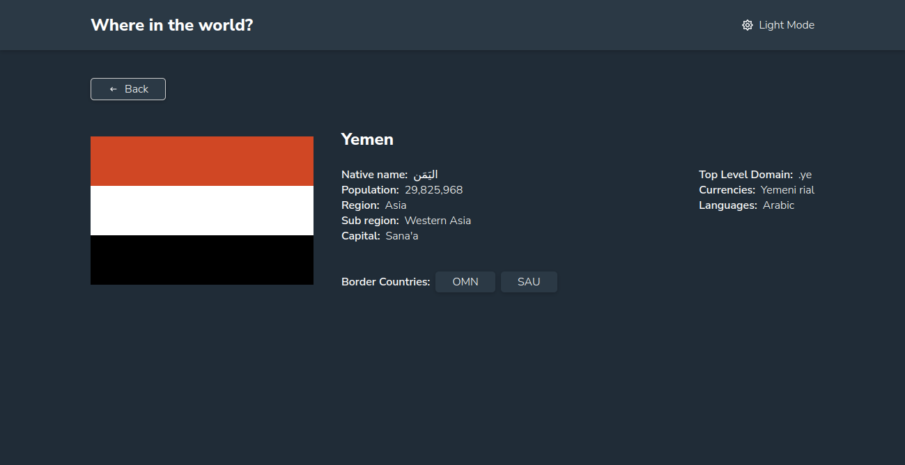
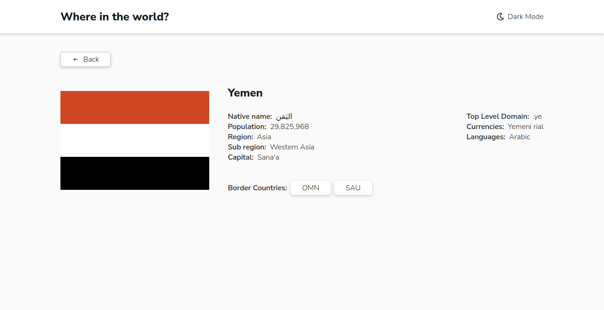
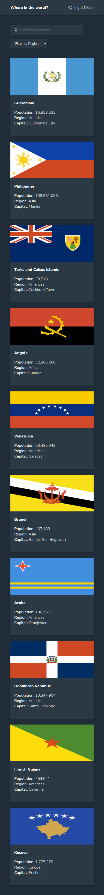
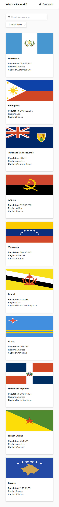
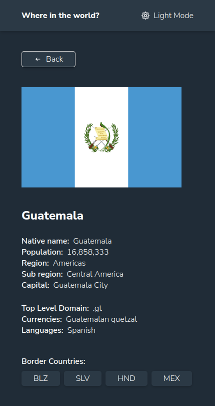
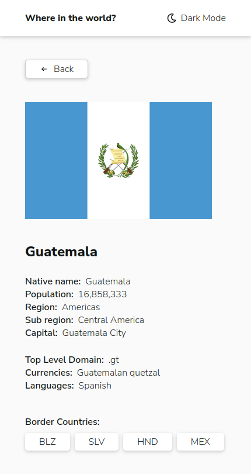

# Frontend Mentor - REST Countries API with color theme switcher solution

This is a solution to the [REST Countries API with color theme switcher challenge on Frontend Mentor](https://www.frontendmentor.io/challenges/rest-countries-api-with-color-theme-switcher-5cacc469fec04111f7b848ca). Frontend Mentor challenges help you improve your coding skills by building realistic projects. 

## Table of contents

- [Overview](#overview)
  - [The challenge](#the-challenge)
  - [Screenshot](#screenshot)
  - [Links](#links)
- [My process](#my-process)
  - [Built with](#built-with)
  - [What I learned](#what-i-learned)
  - [Continued development](#continued-development)
  - [Useful resources](#useful-resources)
- [Author](#author)

## Overview

### The challenge

Users should be able to:

- See all countries from the API on the homepage
- Search for a country using an `input` field
- Filter countries by region
- Click on a country to see more detailed information on a separate page
- Click through to the border countries on the detail page
- Toggle the color scheme between light and dark mode *(optional)*

### Screenshot

















### Links

- Solution URL: [https://github.com/NahlaGalal/Rest-countries-api](https://github.com/NahlaGalal/Rest-countries-api)
- Live Site URL: [https://rest-countries-api-project-9olo.vercel.app/](https://rest-countries-api-project-9olo.vercel.app/)

## My process

### Built with

- Semantic HTML5 markup
- CSS custom properties
- Flexbox
- CSS Grid
- [Svelte](https://svelte.dev/) - JS library
- [Svelte routing](https://github.com/EmilTholin/svelte-routing) - A declarative Svelte routing library with SSR support.
- [Svelte icons](https://github.com/Introvertuous/svelte-icons) - Icons components for Svelte
- [Typescript](https://www.typescriptlang.org/) - Javascript syntax for types

### What I learned

- How to create Svelte component
- How to use lifecycle methods.
- How to apply routing 
- Add `-s` to start script to apply routing correctly
  ```js
  "start": "sirv public -s",
  ```


### Continued development

- Context in Svelte
- Stores in Svelte

### Useful resources

- [Svelte documentation](https://svelte.dev/docs#before-we-begin)

## Author

- Website - [Nahla Galal](https://nahla-portfolio.vercel.app/)
- Frontend Mentor - [@NahlaGalal](https://www.frontendmentor.io/profile/NahlaGalal)
- Linkedin - [Nahla Galal](https://www.linkedin.com/in/nahla-galal/)
- Github - [NahlaGalal](https://github.com/NahlaGalal)